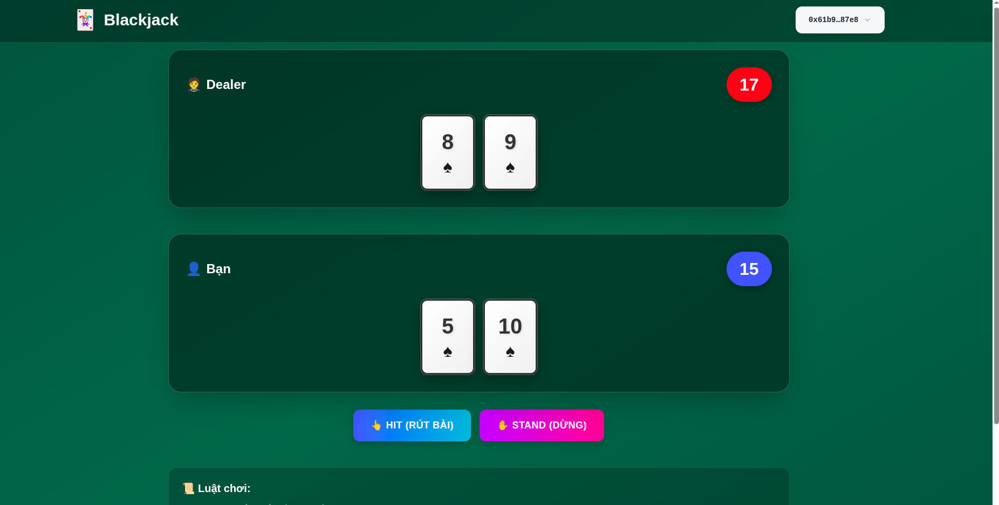
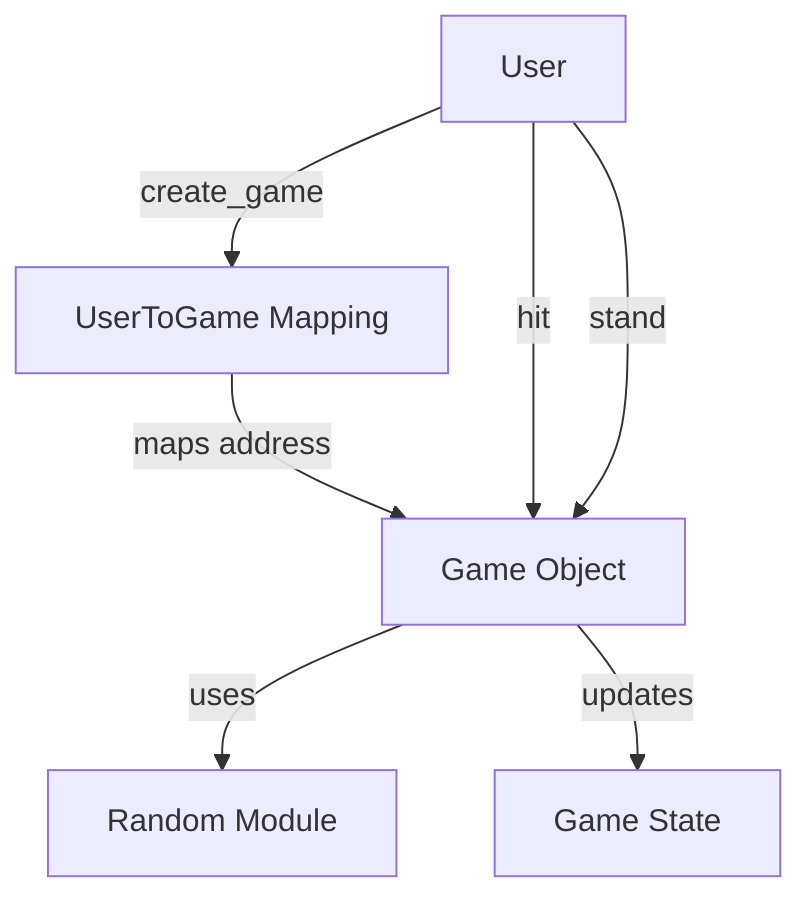

# 🎰 Blackjack on Sui Blockchain

A decentralized Blackjack game built on Sui blockchain with provably fair randomness using Sui's native Random module.



## 📋 Table of Contents

- [Features](#features)
- [Tech Stack](#tech-stack)
- [Project Structure](#project-structure)
- [Smart Contract Logic](#smart-contract-logic)
- [Getting Started](#getting-started)
- [How to Play](#how-to-play)
- [Contract Interaction](#contract-interaction)
- [Development](#development)

## ✨ Features

- 🎲 **Provably Fair** - Uses Sui's native Random module for transparent randomness
- 🔐 **Decentralized** - All game logic runs on Sui blockchain
- 💎 **Beautiful UI** - Modern, responsive design with smooth animations
- ⚡ **Real-time Updates** - Instant game state updates after each action
- 🎮 **Classic Blackjack Rules** - Traditional gameplay with dealer AI

## 🛠 Tech Stack

### Frontend
- **Next.js 15** - React framework
- **TypeScript** - Type safety
- **Tailwind CSS** - Styling
- **Sui TypeScript SDK** - Blockchain interaction
- **@mysten/dapp-kit** - Sui wallet integration

### Smart Contract
- **Sui Move** - Smart contract language
- **Sui Framework** - Standard library
- **Random Module** - On-chain randomness

## 📁 Project Structure

```
blackjack/
├── contract/                 # Smart contracts
│   └── sources/
│       └── contract.move     # Main game contract
├── client/                   # Frontend application
│   ├── app/
│   │   ├── page.tsx         # Main game UI
│   │   └── globals.css      # Global styles
│   ├── hook/
│   │   └── useContract.ts   # Contract interaction hook
│   ├── lib/
│   │   └── constants.ts     # Contract addresses
│   └── type/
│       └── Game.ts          # TypeScript types
└── README.md
```

## 🎯 Smart Contract Logic

### Contract Architecture



### Core Structures

#### 1. UserToGame Mapping
```move
public struct UserToGame has key {
    id: object::UID,
    mapping: table::Table<address, ID>,
}
```
- **Purpose**: Maps each user address to their current game ID
- **Shared Object**: Accessible by all users
- **One Game Per User**: Only one active game allowed at a time

#### 2. Game State
```move
public struct Game has key {
    id: object::UID,
    player: address,
    dealer_points: vector<u8>,      // Dealer's cards (1-10)
    player_points: vector<u8>,      // Player's cards (1-10)
    is_end: bool,                   // Game ended?
    status: u8,                     // Win/Loss/Draw
}
```

### Game Flow

#### 1. **Create Game** (`create_game`)
```move
entry fun create_game(mapping: &mut UserToGame, r: &random::Random, ctx: &mut TxContext)
```

**Logic:**
1. Check if user already has a game → remove old game ID from mapping
2. Create new Game object with empty card arrays
3. Deal 2 cards to dealer using `random_point()`
4. Deal 2 cards to player using `random_point()`
5. Store game ID in UserToGame mapping
6. Share game object on blockchain

**Example:**
```
Player: [7, 5] = 12
Dealer: [8, 9] = 17
```

#### 2. **Hit** (`hit`)
```move
entry fun hit(game: &mut Game, r: &random::Random, ctx: &mut TxContext)
```

**Logic:**
1. Generate random card (1-10) using Sui Random
2. Add card to player's hand
3. Calculate total points
4. If total > 21 → Player busts → Dealer wins
5. If total ≤ 21 → Continue game

**Example:**
```
Before: Player [7, 5] = 12
Hit: Draw 8
After: Player [7, 5, 8] = 20
```

#### 3. **Stand** (`stand`)
```move
entry fun stand(game: &mut Game, r: &random::Random, ctx: &mut TxContext)
```

**Logic:**
1. Dealer draws cards until total ≥ 17 (Dealer AI)
2. Calculate final totals for both dealer and player
3. Determine winner:
   - Player > 21 → Dealer wins
   - Dealer > 21 → Player wins
   - Player > Dealer → Player wins
   - Dealer > Player → Dealer wins
   - Equal → Draw
4. Set `is_end = true` and update `status`

**Example:**
```
Player: [7, 5, 8] = 20
Dealer: [8, 9] = 17
Dealer draws: 3 → [8, 9, 3] = 20
Result: DRAW
```

### Randomness Implementation

```move
fun random_point(r: &random::Random, ctx: &mut TxContext): u8 {
    let mut gen = random::new_generator(r, ctx);
    let value = random::generate_u8_in_range(&mut gen, 1, 10);
    value
}
```

- Uses Sui's native Random module
- Generates values between 1-10 (simplified card values)
- Cryptographically secure randomness
- Verifiable on-chain

### Game Status Codes

```move
const DEALER_WIN: u8 = 0;
const DRAW: u8 = 1;
const PLAYER_WIN: u8 = 2;
```

## 🚀 Getting Started

### Prerequisites

- Node.js 18+
- Sui CLI installed
- Sui wallet (Sui Wallet extension)

### Installation

1. **Clone the repository**
```bash
git clone <your-repo>
cd blackjack
```

2. **Install contract dependencies**
```bash
cd contract
sui move build
```

3. **Publish contract to Sui testnet**
```bash
sui client publish --gas-budget 100000000
```

4. **Copy the published addresses**
After publishing, copy these values:
- Package ID
- UserToGame object ID
- Random object ID (0x8)

5. **Update constants**
```typescript
// client/lib/constants.ts
export const PACKAGE_ID = "YOUR_PACKAGE_ID";
export const MAPPING_ID = "YOUR_MAPPING_ID";
export const RANDOM_ID = "0x8"; // Sui Random module
```

6. **Install frontend dependencies**
```bash
cd ../client
npm install
```

7. **Run the application**
```bash
npm run dev
```

Visit `http://localhost:3000`

## 🎮 How to Play

### Rules

1. **Objective**: Get as close to 21 as possible without going over
2. **Card Values**: Cards are worth 1-10 points (simplified)
3. **Dealer Rules**: Dealer must draw until reaching at least 17
4. **Winning**:
   - Get closer to 21 than dealer
   - Dealer busts (goes over 21)
5. **Losing**:
   - You bust (go over 21)
   - Dealer gets closer to 21
6. **Draw**: Both have same total

### Game Actions

1. **Connect Wallet** - Click "Connect Wallet" button
2. **New Game** - Click "Ván mới" to start
3. **Hit** - Draw another card
4. **Stand** - Stop drawing and let dealer play

## 🔗 Contract Interaction

### Frontend Hook: `useContract`

```typescript
const {fetchCurrentGame, createGame, hit, stand, contractLoading} = useContract({
  address: account?.address,
  setCurrentGame
});
```

### 1. Fetch Current Game

```typescript
const fetchCurrentGame = async () => {
  // 1. Get UserToGame mapping object
  const mappingObjects = await client.getObject({
    id: MAPPING_ID,
    options: {showContent: true},
  });

  // 2. Extract dynamic field ID
  const gameId = content.fields?.mapping?.fields?.id?.id;

  // 3. Get user's game ID from dynamic field
  const fields = await client.getDynamicFields({
    parentId: gameId,
  });

  const userField = fields.data.find((field) => 
    field.name.value === address
  );

  // 4. Get game object using the ID
  const gameObject = await client.getObject({
    id: boardIdContent.fields.value,
    options: {showContent: true},
  });

  // 5. Parse and set game state
  setCurrentGame(gameContent);
};
```

### 2. Create New Game

```typescript
const createGame = async () => {
  const tx = new Transaction();
  tx.moveCall({
    target: `${PACKAGE_ID}::contract::create_game`,
    arguments: [
      tx.object(MAPPING_ID),  // UserToGame mapping
      tx.object(RANDOM_ID)    // Random module
    ],
  });
  
  signAndExecute({transaction: tx});
};
```

### 3. Hit (Draw Card)

```typescript
const hit = async (gameId: string) => {
  const tx = new Transaction();
  tx.moveCall({
    target: `${PACKAGE_ID}::contract::hit`,
    arguments: [
      tx.object(gameId),      // Game object
      tx.object(RANDOM_ID)    // Random module
    ],
  });
  
  signAndExecute({transaction: tx});
};
```

### 4. Stand (End Turn)

```typescript
const stand = async (gameId: string) => {
  const tx = new Transaction();
  tx.moveCall({
    target: `${PACKAGE_ID}::contract::stand`,
    arguments: [
      tx.object(gameId),      // Game object
      tx.object(RANDOM_ID)    // Random module
    ],
  });
  
  signAndExecute({transaction: tx});
};
```

## 🎨 UI Components

### Game Board
- **Dealer Section**: Shows dealer's cards and total points
- **Player Section**: Shows your cards and total points
- **Action Buttons**: Hit, Stand, New Game
- **Status Banner**: Shows game result (Win/Loss/Draw)

### Card Design
```css
.card-3d {
  animation: slideIn 0.3s ease-out;
  transform-style: preserve-3d;
}
```

### Animations
- Card slide-in when dealt
- Bounce-in for status messages
- Smooth transitions for all states

## 🔧 Development

### Run Tests (Contract)
```bash
cd contract
sui move test
```

### Build Contract
```bash
sui move build
```

### Lint Frontend
```bash
cd client
npm run lint
```

### Type Check
```bash
npm run type-check
```

## 📝 Game State TypeScript Types

```typescript
export enum GameStatus {
  DEALER_WIN = 0,
  DRAW = 1,
  PLAYER_WIN = 2,
}

export type Game = {
  id?: string;
  player: string;
  dealer_points: number[];
  player_points: number[];
  is_end: boolean;
  status: GameStatus;
};
```

