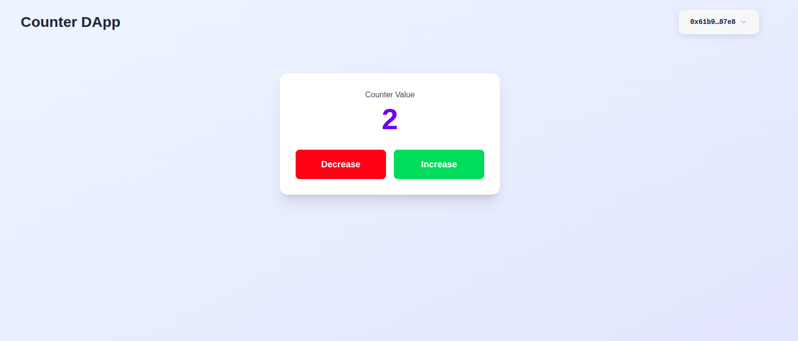

# Sui Counter DApp

A simple decentralized counter application built on Sui blockchain with Next.js frontend.


## 🏗️ Project Structure

```
counter/
├── contract/               # Move smart contract
│   ├── sources/
│   │   └── contract.move  # Counter contract implementation
│   └── tests/
│       └── contract_tests.move
└── client/                # Next.js frontend
    ├── app/
    ├── services/
    │   └── useContract.ts # Contract interaction hook
    └── provider/
        └── provider.tsx   # Sui wallet provider
```

## 📝 Smart Contract Logic

The contract (`contract.move`) implements a shared counter object with three main functions:

### Core Functions

- **`init()`**: Initializes a shared `Counter` object with value 0 on deployment
- **`increase(counter: &mut Counter)`**: Increments counter value by 1
- **`decrease(counter: &mut Counter)`**: Decrements counter value by 1

### Data Structure

```move
public struct Counter has key {
    id: object::UID,
    value: u64,
}
```

The `Counter` is a shared object, meaning multiple users can interact with the same counter instance simultaneously.

## 🔗 Frontend Integration

### Wallet Connection
- Uses `@mysten/dapp-kit` for Sui wallet integration
- UI conditionally renders based on connection status:
  - **Not connected**: Shows only Connect Wallet button
  - **Connected**: Displays counter value and Increase/Decrease buttons

### Contract Interaction Flow

1. **Fetch Counter Value**
   ```typescript
   client.getObject({ id: COUNTER_ID, options: { showContent: true } })
   ```
   Retrieves the current counter value from the blockchain

2. **Execute Transaction**
   ```typescript
   // Create transaction
   const tx = new Transaction();
   tx.moveCall({
     target: `${PACKAGE_ID}::contract::increase`,
     arguments: [tx.object(COUNTER_ID)]
   });
   
   // Sign and execute
   signAndExecute({ transaction: tx })
   ```

3. **Wait for Finalization**
   ```typescript
   await client.waitForTransaction({ digest: result.digest });
   ```
   Ensures transaction is confirmed before fetching updated value

4. **Refresh Counter**
   Automatically fetches new counter value after transaction succeeds

### Key Components

- **`useContract` hook**: Manages all blockchain interactions (fetch, increase, decrease)
- **Transaction loading state**: Prevents multiple concurrent transactions
- **Automatic refresh**: Updates UI after each successful transaction

## 🚀 Setup & Deployment

### Prerequisites
- Sui CLI installed
- Node.js 18+

### Contract Deployment

```bash
cd contract
sui move build
sui client publish --gas-budget 100000000
```

After deployment, note:
- **Package ID**: The published contract address
- **Counter Object ID**: The shared Counter object created in `init()`

### Frontend Setup

1. Install dependencies:
```bash
cd client
npm install
```

2. Update contract IDs in `constant/index.ts`:
```typescript
export const PACKAGE_ID = "YOUR_PACKAGE_ID";
export const COUNTER_ID = "YOUR_COUNTER_ID";
```

3. Run development server:
```bash
npm run dev
```

## 🔑 Key Features

- **Shared Object Pattern**: Single counter accessible by all users
- **Real-time Updates**: Auto-refresh after transaction confirmation
- **Transaction Safety**: Waits for finalization before updating UI
- **Loading States**: Prevents race conditions during transactions
- **Wallet Integration**: Seamless connection with Sui wallets

## 📦 Technologies

- **Blockchain**: Sui Move
- **Frontend**: Next.js 15, TypeScript, Tailwind CSS
- **Sui SDK**: `@mysten/dapp-kit`, `@mysten/sui`

## 🧪 Testing

Run Move tests:
```bash
cd contract
sui move test
```

The test suite covers:
- Basic increment/decrement operations
- Multiple sequential operations
- Value verification

---

**Note**: This is a demo project for learning Sui blockchain development and Move smart contracts.