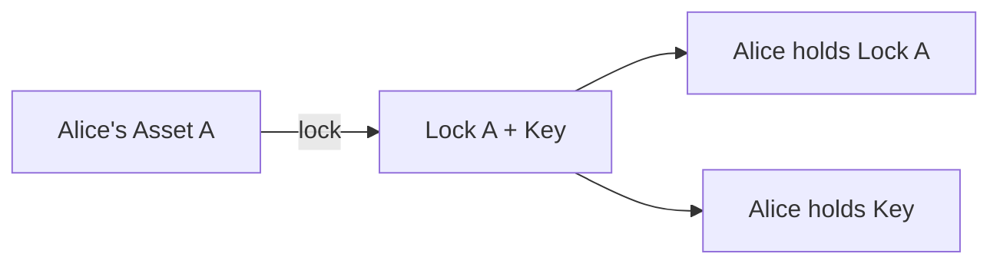
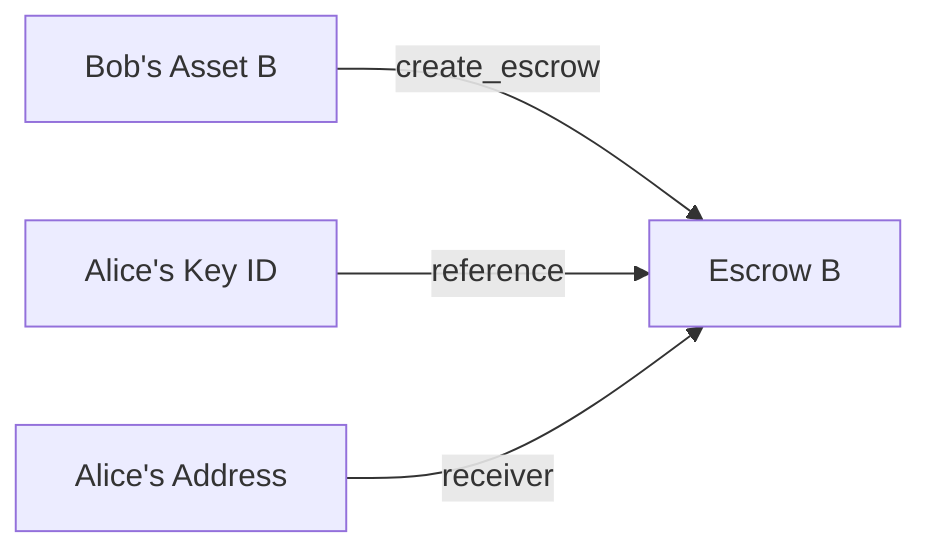
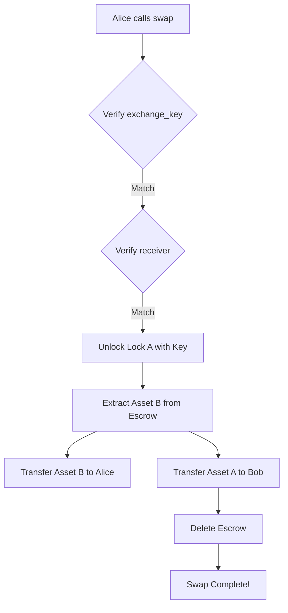
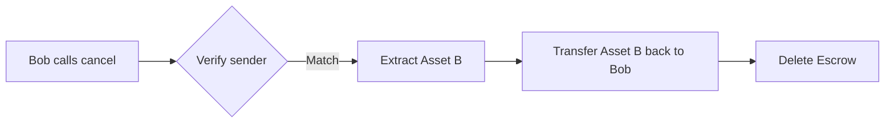

# 🔄 Trustless Swap Protocol

A trustless atomic swap protocol built on Sui Move that enables two parties to exchange digital assets without requiring a trusted intermediary.

## 📋 Table of Contents

- [Overview](#overview)
- [Architecture](#architecture)
- [Protocol Flow](#protocol-flow)
- [Smart Contracts](#smart-contracts)
- [Usage Example](#usage-example)
- [Security Features](#security-features)

## 🎯 Overview

The Trustless Swap protocol allows two parties (Alice and Bob) to safely exchange assets on the Sui blockchain. The protocol ensures atomicity - either both parties receive their assets, or the swap is canceled and both parties retain their original assets.

### Key Features

- ✅ **Trustless**: No need for a trusted third party
- ✅ **Atomic**: Either the swap completes fully or not at all
- ✅ **Generic**: Works with any asset type that has `key + store` abilities
- ✅ **Cancellable**: Initiator can cancel before the swap completes
- ✅ **Type-safe**: Leverages Move's type system for safety

## 🏗️ Architecture

The protocol consists of two main modules:

### 1. Lock Module (`contract::lock`)

Allows users to lock assets with a cryptographic key mechanism.

**Key Structs:**
- `Lock<T>`: Container holding a locked asset of type T
- `Key`: Unique key required to unlock the asset
- `LockedAsset`: Marker for dynamic field storage

**Main Functions:**
- `lock<T>()`: Locks an asset and returns a Lock and Key pair
- `unlock<T>()`: Unlocks and retrieves the asset using the Key

### 2. Escrow Module (`contract::escrow`)

Manages the escrow mechanism for atomic swaps.

**Key Structs:**
- `Escrow<T>`: Holds an escrowed asset waiting for exchange
- `EscrowedObjectKey`: Marker for dynamic field storage

**Main Functions:**
- `create_escrow<T>()`: Creates an escrow for an asset
- `swap<T, U>()`: Executes the atomic swap
- `cancel<T>()`: Cancels the escrow and returns the asset

## 🔄 Protocol Flow

### Scenario: Alice and Bob want to swap assets

```
Alice has: Asset A (e.g., 100 SUI)
Bob has:   Asset B (e.g., 50 SUI)

Goal: Exchange assets trustlessly
```

### Step-by-Step Execution

#### **Phase 1: Alice Locks Her Asset** 🔒

Alice locks her asset and generates a Lock-Key pair.



**What happens:**
- Asset A is locked in a `Lock<A>` container
- A unique `Key` is generated that's cryptographically linked to the Lock
- Only this specific Key can unlock this specific Lock

#### **Phase 2: Bob Creates Escrow** 📦

Bob sees Alice's Key ID and creates an escrow with his asset.



**What happens:**
- Asset B is stored in an `Escrow<B>` as a dynamic object field
- The escrow records:
  - `sender`: Bob's address
  - `receiver`: Alice's address
  - `exchange_key`: ID of Alice's Key (the one that unlocks Lock A)
- The escrow is shared publicly on the blockchain

#### **Phase 3: Alice Executes the Swap** 🔄

Alice can now execute the swap using her Key, Bob's Lock, and the Escrow.



**What happens:**
1. **Verification**:
   - Check that Alice's Key matches the `exchange_key` in the escrow
   - Check that Alice (caller) is the designated `receiver`
   
2. **Asset Extraction**:
   - Use Alice's Key to unlock Lock A and retrieve Asset A
   - Remove Asset B from the Escrow
   
3. **Asset Transfer**:
   - Transfer Asset B to Alice (receiver)
   - Transfer Asset A to Bob (escrow sender)
   
4. **Cleanup**:
   - Delete the Key object
   - Delete the Lock object
   - Delete the Escrow object

#### **Alternative: Cancel Before Swap** ❌

Bob can cancel the escrow before Alice executes the swap.



## 📜 Smart Contracts

### Lock Contract

```move
// Lock an asset
public fun lock<T: key + store>(asset: T, ctx: &mut TxContext) : (Lock<T>, Key)

// Unlock an asset
public fun unlock<T: key + store>(locked: Lock<T>, key: Key) : T
```

### Escrow Contract

```move
// Create escrow for an asset
entry fun create_escrow<T: key + store>(
    escrowed_asset: T, 
    exchange_key: ID, 
    receiver: address, 
    ctx: &mut TxContext
)

// Execute atomic swap
entry fun swap<T: key + store, U: key + store>(
    escrow: Escrow<T>, 
    key: Key, 
    lock: Lock<U>, 
    ctx: &TxContext
)

// Cancel escrow
entry fun cancel<T: key + store>(escrow: Escrow<T>, ctx: &TxContext)
```

## 💻 Usage Example

### Setup

```bash
# Package ID after deployment
PACKAGE_ID=0x970295d4c81b762bc3c3ec0629e06142b058f41b9b433a3bbee905d02abd7dbb

# Alice's address
ALICE=0x3de07e715a9bf8a3bbac67507249b90b65543f7c80d29e650a76196bf7034e25

# Bob's address (implied from context)
BOB=<bob_address>
```

### Step 1: Alice Locks Her Asset 🔒

```bash
# Alice locks 100 SUI coin
sui client call \
  --package $PACKAGE_ID \
  --module lock \
  --function entry_lock \
  --type-args "0x2::coin::Coin<0x2::sui::SUI>" \
  --args 0xd1883c80d27dd8d242e237518c19db6716a20dcf741de9286573e71453718928
```

**Output:**
```
Lock Object: 0xaa6491a2e818da3edc189048d43308b932c8a7daaf44c27f97fa8692ae4857a4
Key Object:  0xc0e8849d9ed96580c327eafeab1da894282b3687ea3c65f88c3c0fe2dfe1aa36
```

Alice now has:
- `Lock<Coin<SUI>>` containing her asset
- `Key` that can unlock this Lock

### Step 2: Bob Creates Escrow 📦

```bash
# Bob creates escrow with his 50 SUI coin
# References Alice's Key ID and sets Alice as receiver
sui client call \
  --package $PACKAGE_ID \
  --module escrow \
  --function create_escrow \
  --type-args "0x2::coin::Coin<0x2::sui::SUI>" \
  --args \
    0x775b5645b506d2b93f1a166be7eeb43133a765b191079ff6d9041c9edd60e808 \
    0xc0e8849d9ed96580c327eafeab1da894282b3687ea3c65f88c3c0fe2dfe1aa36 \
    0x3de07e715a9bf8a3bbac67507249b90b65543f7c80d29e650a76196bf7034e25
```

**Parameters:**
- `0x775b...`: Bob's SUI coin object to escrow
- `0xc0e8...`: Alice's Key ID (exchange_key)
- `0x3de0...`: Alice's address (receiver)

**Output:**
```
Escrow Object: 0xec4902c728ab6f76ec038af27b215cc6bcf66f6c20ef56226270175eb40417bf
```

Bob's asset is now escrowed and publicly visible on-chain.

### Step 3: Alice Executes the Swap 🔄

```bash
# Alice swaps by providing the Escrow, her Key, and Alice's Lock
sui client call \
  --package $PACKAGE_ID \
  --module escrow \
  --function swap \
  --type-args \
    "0x2::coin::Coin<0x2::sui::SUI>" \
    "0x2::coin::Coin<0x2::sui::SUI>" \
  --args \
    0xec4902c728ab6f76ec038af27b215cc6bcf66f6c20ef56226270175eb40417bf \
    0xc0e8849d9ed96580c327eafeab1da894282b3687ea3c65f88c3c0fe2dfe1aa36 \
    0xaa6491a2e818da3edc189048d43308b932c8a7daaf44c27f97fa8692ae4857a4
```

**Parameters:**
- Type args: `<T, U>` = `<Coin<SUI>, Coin<SUI>>`
- `0xec49...`: Escrow object containing Bob's asset
- `0xc0e8...`: Alice's Key
- `0xaa64...`: Alice's Lock containing her asset

**Result:**
- ✅ Alice receives Bob's 50 SUI
- ✅ Bob receives Alice's 100 SUI
- ✅ All objects (Escrow, Lock, Key) are deleted
- ✅ Swap complete!

## 🔒 Security Features

### 1. **Key-Lock Verification**
The `swap` function verifies that the Key matches the exchange_key stored in the Escrow:
```move
assert!(escrow.exchange_key == object::id(&key), EMismatchedExchangeObject);
```

### 2. **Receiver Verification**
Only the designated receiver can execute the swap:
```move
assert!(escrow.receiver == ctx.sender(), EMismatchedSenderRecipient);
```

### 3. **Atomic Execution**
The swap either completes fully or reverts entirely - no partial states.

### 4. **Type Safety**
Move's type system ensures assets can't be mixed or mishandled:
```move
swap<T: key + store, U: key + store>(...)
```

### 5. **Sender Protection**
Only the original sender can cancel an escrow:
```move
assert!(escrow.sender == ctx.sender(), EMismatchedSenderRecipient);
```

### 6. **Dynamic Object Fields**
Assets are stored safely as dynamic object fields, preventing unauthorized access.

