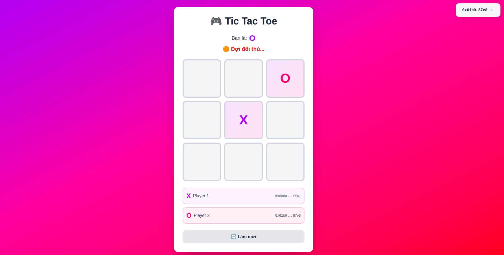

# Tic Tac Toe on Sui Blockchain

A fully decentralized Tic Tac Toe game built on Sui blockchain using Move smart contracts and Next.js frontend.



## 🎮 Features

- **Fully On-Chain**: All game logic and state stored on Sui blockchain
- **Real-time Multiplayer**: Play against another wallet address
- **Single Active Game**: Each address can only have one active game at a time
- **Automatic Win Detection**: Smart contract automatically detects win conditions
- **Beautiful UI**: Modern, responsive interface with smooth animations

## 📋 Table of Contents

- [Smart Contract Logic](#smart-contract-logic)
- [Architecture](#architecture)
- [Setup & Installation](#setup--installation)
- [How to Play](#how-to-play)
- [Contract Interaction](#contract-interaction)
- [Technical Details](#technical-details)

## 🔧 Smart Contract Logic

### Data Structures

#### PlayingBoard (Shared Object)
```move
public struct PlayingBoard has key {
    id: UID,
    mapping: Table<address, ID>,  // Maps player address to their active board ID
}
```

This shared object acts as a registry to track which players have active games.

#### Board (Shared Object)
```move
public struct Board has key {
    id: UID,
    player: vector<address>,      // [player1, player2] - Player1 is X, Player2 is O
    next_player: address,          // Address of the player whose turn it is
    game: vector<address>,         // 9 cells (index 0-8), @0x0 means empty
    winner: address,               // Winner's address or @0x0
    ended: bool,                   // Game status
}
```

### Core Functions

#### 1. `init(ctx: &mut TxContext)`
- Automatically called when contract is published
- Creates the `PlayingBoard` shared object
- Initializes empty mapping table

#### 2. `create_board(playing: &mut PlayingBoard, player_with: address, ctx: &mut TxContext)`
- **Purpose**: Creates a new game board between two players
- **Parameters**:
  - `playing`: Reference to the PlayingBoard registry
  - `player_with`: Address of the opponent
  - `ctx`: Transaction context (provides sender address)
  
- **Logic**:
  1. Creates new Board with:
     - `player[0]` = creator (plays X)
     - `player[1]` = opponent (plays O)
     - `next_player` = creator (X goes first)
     - `game` = 9 empty cells (all @0x0)
  2. Adds both player addresses to PlayingBoard mapping with board ID
  3. Shares the Board object

- **Constraints**:
  - Cannot create if either player already has an active game

#### 3. `play_game(playing: &mut PlayingBoard, board: &mut Board, position: u8, ctx: &TxContext)`
- **Purpose**: Make a move on the board
- **Parameters**:
  - `playing`: Reference to PlayingBoard
  - `board`: Reference to the game board
  - `position`: Cell position (0-8)
  - `ctx`: Transaction context

- **Validation** (with abort codes):
  - `assert!(!board.ended, 0)` - Game must not be ended
  - `assert!(position < 9, 1)` - Position must be valid (0-8)
  - `assert!(cell == @0x0, 3)` - Cell must be empty
  - `assert!(ctx.sender() == board.next_player, 2)` - Must be player's turn

- **Logic**:
  1. Validates the move (as above)
  2. Updates the cell with player's address
  3. Switches turn to other player
  4. Checks for win condition (row/column/diagonal)
  5. If someone wins:
     - Sets `ended = true`
     - Sets `winner` to player's address
     - Removes both players from PlayingBoard mapping (frees them to play again)

### Win Detection

Three helper functions check win conditions:

#### `check_row(board: &Board): bool`
- Checks all 3 rows
- Returns true if any row has 3 identical non-empty addresses

#### `check_column(board: &Board): bool`
- Checks all 3 columns
- Returns true if any column has 3 identical non-empty addresses

#### `check_diagonal(board: &Board): bool`
- Checks both diagonals (0-4-8 and 2-4-6)
- Returns true if either diagonal has 3 identical non-empty addresses

### Game Board Layout
```
Position indices:
0 | 1 | 2
---------
3 | 4 | 5
---------
6 | 7 | 8
```

## 🏗️ Architecture

### Smart Contract (Move)
```
contract/
├── sources/
│   └── contract.move          # Main game logic
├── tests/
│   └── contract_tests.move    # Unit tests
└── Move.toml                  # Package configuration
```

### Frontend (Next.js + TypeScript)
```
client/
├── app/
│   ├── page.tsx               # Main game UI
│   ├── layout.tsx             # Root layout
│   └── globals.css            # Global styles
├── hooks/
│   └── useContract.ts         # Contract interaction hook
├── lib/
│   └── constants.ts           # Contract addresses
├── type/
│   └── Board.ts               # TypeScript types
└── provider/
    └── provider.tsx           # Sui wallet provider
```

## 🚀 Setup & Installation

### Prerequisites
- Node.js v18+
- Sui CLI
- A Sui wallet (Sui Wallet extension recommended)

### 1. Deploy Smart Contract

```bash
cd contract

# Build the contract
sui move build

# Publish to Sui testnet
sui client publish --gas-budget 100000000

# Note down:
# - Package ID: 0x...
# - PlayingBoard Object ID: 0x... (type: <PACKAGE_ID>::contract::PlayingBoard)
```

### 2. Configure Frontend

```bash
cd ../client

# Install dependencies
npm install

# Update contract addresses in lib/constants.ts
```

Edit `client/lib/constants.ts`:
```typescript
export const PACKAGE_ID = "0x2ca12843df06f2807b8fb4ef590cd08c08859edb0feffe59ac1520c5a114baac";
export const PLAYING_BOARD_ID = "0x0065dcde07e293d81ed346f9053c4e0efc18086f908a893b48be6fcb53b10a7e";
```

### 3. Run Frontend

```bash
npm run dev
```

Open [http://localhost:3000](http://localhost:3000)

## 🎯 How to Play

### Step 1: Connect Wallet
Click "Connect Wallet" button in the top-right corner

### Step 2: Create a Game
If you don't have an active game:
1. Click "Create New Game"
2. Enter opponent's Sui address (0x...)
3. Click "Create"
4. Approve transaction in wallet

### Step 3: Play
- You are assigned **X** (go first) or **O** (go second)
- Click an empty cell when it's your turn
- Wait for opponent's move
- Game automatically detects winner

### Step 4: Start New Game
After game ends:
1. Click "New Game" button
2. Both players are freed from the registry
3. Create a new game with any opponent

## 🔗 Contract Interaction

### Reading Board State

#### Get Current Board for an Address
```typescript
// 1. Get PlayingBoard object
const playingBoard = await client.getObject({
  id: PLAYING_BOARD_ID,
  options: { showContent: true }
});

// 2. Extract table ID
const tableId = playingBoard.data.content.fields.mapping.fields.id.id;

// 3. Query dynamic fields (table entries)
const fields = await client.getDynamicFields({
  parentId: tableId
});

// 4. Find user's entry
const userField = fields.data.find(
  field => field.name.value === userAddress
);

// 5. Get board ID from dynamic field
const boardIdObject = await client.getObject({
  id: userField.objectId,
  options: { showContent: true }
});

const boardId = boardIdObject.data.content.fields.value;

// 6. Get actual board data
const board = await client.getObject({
  id: boardId,
  options: { showContent: true }
});
```

### Writing Transactions

#### Create a New Board
```typescript
const tx = new Transaction();

tx.moveCall({
  target: `${PACKAGE_ID}::contract::create_board`,
  arguments: [
    tx.object(PLAYING_BOARD_ID),
    tx.pure.address(opponentAddress)
  ]
});

await signAndExecuteTransaction({ transaction: tx });
```

#### Make a Move
```typescript
const tx = new Transaction();

tx.moveCall({
  target: `${PACKAGE_ID}::contract::play_game`,
  arguments: [
    tx.object(PLAYING_BOARD_ID),
    tx.object(boardId),
    tx.pure.u8(position)  // 0-8
  ]
});

await signAndExecuteTransaction({ transaction: tx });
```

## 🔍 Technical Details

### Why Use Table for PlayingBoard?

The `Table<address, ID>` in PlayingBoard serves as a registry:
- **Key**: Player's address
- **Value**: Active board ID
- **Purpose**: Enforce one-game-per-player constraint
- **Cleanup**: Entries removed when game ends

### Dynamic Fields vs Table

Sui's `Table` type stores data as dynamic fields:
- Not loaded into memory unless accessed
- Efficient for large datasets
- Requires special querying (`getDynamicFields` API)

### Address Zero (@0x0)

Used as a sentinel value:
- Empty board cells: `@0x0`
- No winner (draw): `@0x0`
- Allows distinguishing between empty/occupied states

### Turn Management

Simple alternating logic:
```move
if (ctx.sender() == board.player[0]) {
    board.next_player = board.player[1];
} else {
    board.next_player = board.player[0];
}
```

### Gas Optimization

- Use vectors instead of dynamic fields for game board (9 cells)
- Batch state updates in single transaction
- Clean up registry when game ends

## 🧪 Testing

Run contract tests:
```bash
cd contract
sui move test
```

Test output shows:
- Board creation
- Turn validation
- Win detection
- Registry cleanup

## 📝 Error Codes

| Code | Meaning |
|------|---------|
| 0 | Game already ended |
| 1 | Invalid position (must be 0-8) |
| 2 | Not your turn |
| 3 | Cell already occupied |

## 🛠️ Technologies Used

- **Blockchain**: Sui
- **Smart Contract**: Move
- **Frontend**: Next.js 14, React 18
- **Wallet Integration**: @mysten/dapp-kit
- **Styling**: Tailwind CSS
- **TypeScript**: Full type safety

## 📄 License

MIT License - Feel free to use this project for learning and development!

## 🤝 Contributing

Contributions are welcome! Please feel free to submit a Pull Request.

## 📧 Contact

For questions or support, please open an issue on GitHub.

---

**Happy Gaming on Sui! 🎮⛓️**
